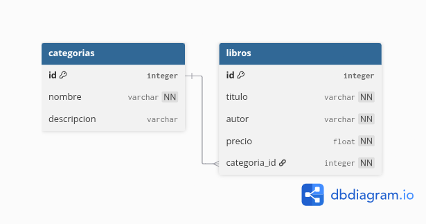

# Gestor de Biblioteca (SQLAlchemy ORM + MVC)

Sistema modular de gestión de libros y categorías desarrollado en Python, utilizando **SQLAlchemy ORM** para la persistencia de datos y el patrón **Modelo-Vista-Controlador (MVC)** para mantener una arquitectura limpia, extensible y fácil de mantener.

---

## Índice

1. [Estructura del proyecto](#estructura-del-proyecto)
2. [Arquitectura MVC](#arquitectura-mvc)
3. [Modelos y relaciones](#modelos-y-relaciones)
4. [Controladores](#controladores)
5. [Vistas (CLI)](#vistas-cli)
6. [Notas técnicas](#notas-técnicas)
7. [Diagrama de base de datos](#diagrama-de-base-de-datos)
8. [Instalación y uso](#instalación-y-uso)
9. [Autoría](#autoría)

---

## Estructura del proyecto

```bash
gestor_biblioteca/
├── models/
│   ├── base.py               # Configuración del engine y declarative_base()
│   ├── libro.py              # Modelo ORM Libro (con relación a Categoría)
│   └── categoria.py          # Modelo ORM Categoría
│
├── controller/
│   ├── libro_controller.py   # Operaciones CRUD y búsquedas de libros
│   └── categoria_controller.py  # Operaciones CRUD de categorías
│
├── view/
│   ├── main_menu.py          # Menú principal del sistema
│   ├── menu_libros.py        # Submenú de libros
│   └── menu_categorias.py    # Submenú de categorías
│
└── main.py                   # Punto de entrada de la aplicación
```

**Tipo de arquitectura:** MVC  
**Lenguaje:** Python 3.11+  
**ORM:** SQLAlchemy 2.0  
**Base de datos:** SQLite (por defecto)

---

## Arquitectura MVC

### Modelo (`models/`)

Define las clases ORM y su estructura relacional. Contiene `Libro` y `Categoria`, además de la configuración base (`engine`, `SessionLocal`, etc.).  
Cada clase refleja una tabla en la base de datos y define relaciones con claves foráneas.

### Controlador (`controller/`)

Gestiona la lógica de negocio y operaciones CRUD. No maneja la entrada/salida directa, sino que coordina las acciones entre la vista y el modelo.  
Ejemplo: insertar un libro, buscar por autor o eliminar por título.

### Vista (`view/`)

Maneja la interacción con el usuario. Presenta menús y recoge entradas en consola (CLI). Llama a los métodos de los controladores y muestra los resultados.

**Separación de responsabilidades:**

-   La vista nunca accede directamente a SQLAlchemy.
-   El controlador no formatea texto ni imprime.
-   El modelo no conoce la interfaz ni la lógica de flujo.

---

## Modelos y relaciones



```python
# Ejemplo simplificado de relación
class Libro(Base):
    __tablename__ = "libros"
    id = Column(Integer, primary_key=True)
    titulo = Column(String(100))
    autor = Column(String(100))
    precio = Column(Float)
    categoria_id = Column(Integer, ForeignKey("categorias.id"))
    categoria = relationship("Categoria", back_populates="libros")

class Categoria(Base):
    __tablename__ = "categorias"
    id = Column(Integer, primary_key=True)
    nombre = Column(String(100))
    descripcion = Column(String(200))
    libros = relationship("Libro", back_populates="categoria", cascade="all, delete")
```

**Relación:**  
Una categoría puede contener muchos libros (**1 → N**).  
Un libro pertenece exactamente a una categoría (**N → 1**).

---

## Controladores

### `libro_controller.py`

Incluye funciones para:

-   `insertar(titulo, autor, precio, categoria_id)`
-   `listar()`
-   `buscar_por_autor(autor)`
-   `buscar_por_categoria(categoria_id)`
-   `actualizar_precio(titulo, nuevo_precio)`
-   `eliminar_por_titulo(titulo)`

### `categoria_controller.py`

Incluye funciones para:

-   `crear(nombre, descripcion)`
-   `listar()`
-   `eliminar(id)`

**Gestión de transacciones:**

-   Uso de `SessionLocal()` para abrir sesión.
-   Estructura `try/except/finally` para commit, rollback y cierre.
-   Manejo de `SQLAlchemyError` para revertir operaciones fallidas.

---

## Vistas (CLI)

Diseñadas para evitar un “menú todopoderoso” y mejorar la modularidad:

-   `main_menu.py`: menú principal del sistema.
-   `menu_libros.py`: submenú con operaciones de libros.
-   `menu_categorias.py`: submenú con operaciones de categorías.

Cada vista se comunica **solo con los controladores**, no con los modelos directamente.

---

## Notas técnicas

**[INFO]**

-   Las tablas se crean automáticamente con `Base.metadata.create_all(engine)` la primera vez que se ejecuta el sistema.
-   Por defecto, la base de datos `biblioteca.db` se almacena en la carpeta `datos/`.

**[DEPENDENCIAS]**

-   SQLAlchemy >= 2.0
-   Python >= 3.11

Instalación:

```bash
pip install sqlalchemy
```

**[TAG: diseño]**

-   Arquitectura modular
-   Compatible con futura migración a interfaz gráfica o API REST (Flask/FastAPI)

---

## Diagrama de base de datos

_(Espacio reservado para el diagrama entidad-relación, exportado desde DBeaver o Draw.io)_

```text
[ Aquí irá el diagrama de la base de datos ]
```

---

## Instalación y uso

### Clonar el repositorio

```bash
git clone https://github.com/usuario/gestor_biblioteca.git
cd gestor_biblioteca
```

### Crear entorno virtual (opcional pero recomendado)

```bash
python -m venv .venv
source .venv/bin/activate  # En Linux
.venv\Scripts\activate     # En Windows
```

### Instalar dependencias

```bash
pip install -r requirements.txt
```

### Ejecutar el sistema

```bash
python main.py
```

---

## Autoría

**Proyecto académico desarrollado por:**  
Yeremy — Ingeniería de Sistemas, Universidad Distrital

**Versión:** 1.0  
**Licencia:** MIT
